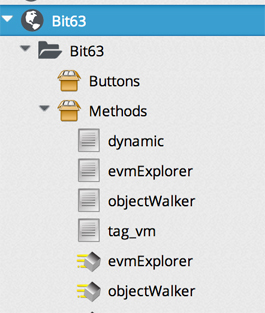
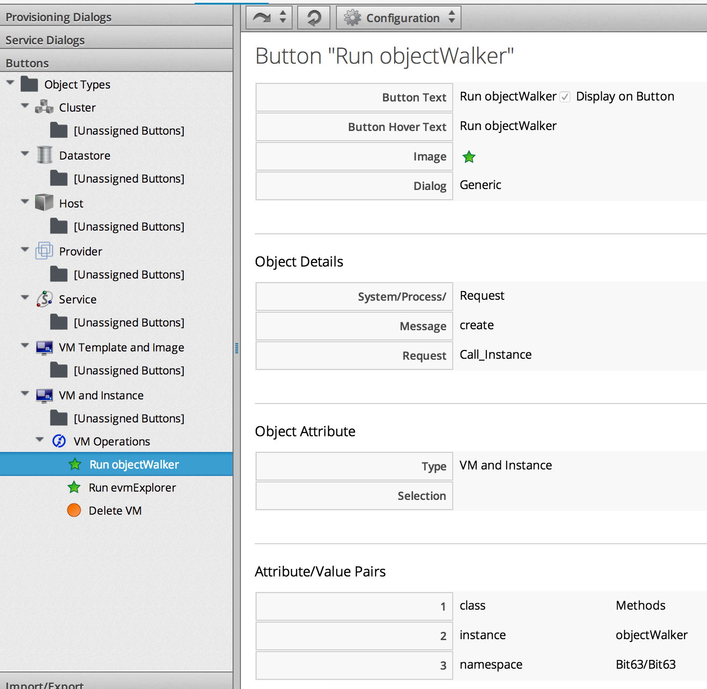

One of the challenges when starting out writing CloudForms or ManageIQ automation scripts, is knowing where the objects and attributes are under $evm.root that we may need to access. For example, depending on the automation action, we may have an $evm.root['vm'] object, or we may not.

This script is an attempt to demystify the object structure that is available at any point in the Automation engine.

Calling the script from any point will walk the object hierarchy from $evm.root downwards, printing objects and attributes
as it goes, i.e.


```
objectWalker 1.0 - EVM Automate Method Started
      objectWalker:   Dumping $evm.root
      objectWalker:   $evm.root.ae_result = ok   (type: String)
      objectWalker:   $evm.root.ae_state = RegisterDHCP   (type: String)
      objectWalker:   $evm.root.ae_state_retries = 0   (type: Fixnum)
      objectWalker:   $evm.root.ae_state_started = 2014-09-18 12:00:57 UTC   (type: String)
      objectWalker:   $evm.root['miq_provision'] => #<MiqAeMethodService::MiqAeServiceMiqProvisionRedhatViaPxe:0x0000000f6b5d78>
      |    objectWalker:   $evm.root['miq_provision'].created_on = 2014-09-18 11:33:22 UTC   (type: ActiveSupport::TimeWithZone)
      |    objectWalker:   $evm.root['miq_provision'].description = Provision from [Generic] to [cfme027]   (type: String)
      |    objectWalker:   $evm.root['miq_provision'].destination_id = 1000000000058   (type: Fixnum)
      |    objectWalker:   $evm.root['miq_provision'].destination_type = VmOrTemplate   (type: String)
      |    objectWalker:   $evm.root['miq_provision'].id = 1000000000102   (type: Fixnum)
      |    objectWalker:   $evm.root['miq_provision'].message = Registering DHCP   (type: String)
      ...
      |    objectWalker:   --- virtual columns follow ---
      |    objectWalker:   $evm.root['miq_provision'].provision_type = template   (type: String)
      |    objectWalker:   $evm.root['miq_provision'].region_description = Region 1   (type: String)
      ...
      |    objectWalker:   --- end of virtual columns ---
      |    objectWalker:   $evm.root['miq_provision'].destination (type: Association, objects found)
      |    objectWalker:   destination = $evm.root['miq_provision'].destination
      |    |    objectWalker:   (object type: MiqAeServiceVmRedhat, object ID: 1000000000058)
      |    |    objectWalker:   destination.connection_state = connected   (type: String)
      |    |    objectWalker:   destination.created_on = 2014-09-18 11:35:17 UTC   (type: ActiveSupport::TimeWithZone)
```
  etc

Many of the objects that we can walk through are in fact Rails Active Record Associations (object representations of database
records), and we often don't want to print all of them. The script has a variable @walk_association_policy, that should have
the value of either :whitelist or :blacklist.

if @walk_association_policy = :whitelist, then objectWalker will only traverse associations of objects that are explicitly
mentioned in the @walk_association_whitelist hash. This enables us to carefully control what is dumped. If objectWalker finds
an association that isn't in the hash, it will print a line similar to:

```ruby
$evm.root['vm'].datacenter (type: Association, objects found)
   (datacenter isn't in the @walk_associations hash for MiqAeServiceVmRedhat...)
```

If you wish to explore and dump this associaiton, edit the hash to add the association name to the list associated with the
object type. The symbol :ALL can be used to walk all associations of an object type

```ruby
@walk_association_whitelist = { "MiqAeServiceServiceTemplateProvisionTask" => ["source", "destination", "miq_request"],
                                "MiqAeServiceServiceTemplate" => ["service_resources"],
                                "MiqAeServiceServiceResource" => ["resource", "service_template"],
                                "MiqAeServiceMiqProvisionRequest" => ["miq_request", "miq_request_tasks"],
                                "MiqAeServiceMiqProvisionRequestTemplate" => ["miq_request", "miq_request_tasks"],
                                "MiqAeServiceMiqProvisionVmware" => ["source", "destination", "miq_provision_request"],
                                "MiqAeServiceMiqProvisionRedhatViaPxe" => [:ALL],
                                "MiqAeServiceVmVmware" => ["ems_cluster", "storage", "service", "hardware"],
                                "MiqAeServiceVmRedhat" => ["ems_cluster", "storage", "service", "hardware"],
                                "MiqAeServiceHardware" => ["nics"]}
```

if @walk_association_policy = :blacklist, then objectWalker will traverse all associations of all objects, except those that
are explicitly mentioned in the @walk_association_blacklist hash. This enables us to run a more exploratory dump, at the
cost of a much more verbose output. The symbol:ALL can be used to prevent the walking any associations of an object type

```ruby
@walk_association_blacklist = { "MiqAeServiceEmsCluster" => ["all_vms", "vms", "ems_events"],
                                "MiqAeServiceEmsRedhat" => ["ems_events"],
                                "MiqAeServiceHostRedhat" => ["guest_applications", "ems_events"]}
```


Several of the objects in the Automate model have circular references to themselves either directly or indirectly through
other associations. To prevent the same object being dumped multiple times the script records where it's been, and prints:

```
objectWalker:   Object MiqAeServiceServiceTemplate with ID 1000000000003 has already been dumped...
```

Many attributes that get dumped have a value of 'nil', i.e.

```
objectWalker:   $evm.root['user'] => #<MiqAeMethodService::MiqAeServiceUser:0x000000056e9bf0>   (type: DRb::DRbObject)
      |    objectWalker:   $evm.root['user'].created_on = 2014-09-16 07:52:05 UTC   (type: ActiveSupport::TimeWithZone)
      |    objectWalker:   $evm.root['user'].current_group_id = 1000000000001   (type: Fixnum)
      |    objectWalker:   $evm.root['user'].email = nil
...
      |    objectWalker:   --- virtual columns follow ---
      |    objectWalker:   $evm.root['user'].allocated_memory = 0   (type: Fixnum)
      |    objectWalker:   $evm.root['user'].allocated_storage = 0   (type: Fixnum)
      |    objectWalker:   $evm.root['user'].allocated_vcpu = 0   (type: Fixnum)
      |    objectWalker:   $evm.root['user'].custom_1 = nil
      |    objectWalker:   $evm.root['user'].custom_2 = nil
      |    objectWalker:   $evm.root['user'].custom_3 = nil
      |    objectWalker:   $evm.root['user'].custom_4 = nil
      |    objectWalker:   $evm.root['user'].custom_5 = nil
```

Sometimes we want to know that the attribute is present, even if its value is nil, but at other times we only wish to know
about attributes with valid values (this also gives us a more concise dump output). In this case we can define the script
variable:

```ruby
@print_nil_values = false
```

and the resulting output dump will leave out any keys or attributes that have nil values.

Use objectWalkerReader to extract the latest (no arguments), or a selected objectWalker dump from automation.log or other
renamed or saved log file.

```
Usage: objectWalkerReader.rb [options]
     -l, --list                       list objectWalker dumps in the file
     -f, --file filename              Full file path to automation.log
     -t, --timestamp timestamp        Date/time of the objectWalker dump to be listed (hint: copy from -l output)
     -h, --help                       Displays Help

 Examples:

 ./objectWalkerReader.rb -l
 Found objectWalker dump at 2014-09-17T13:28:42.052043
 Found objectWalker dump at 2014-09-17T13:34:52.649359
 Found objectWalker dump at 2014-09-17T15:06:29.250086
 Found objectWalker dump at 2014-09-17T15:22:46.034628
 Found objectWalker dump at 2014-09-18T07:56:08.201025
 ...

 ./objectWalkerReader.rb -l -f /Documents/CloudForms/cf30-automation-log
 Found objectWalker dump at 2014-09-18T09:52:28.797868
 Found objectWalker dump at 2014-09-18T09:53:31.455892
 Found objectWalker dump at 2014-09-18T10:05:39.040744
 Found objectWalker dump at 2014-09-18T12:00:59.142460
 ...

 ./objectWalkerReader.rb -t 2014-09-18T09:44:27.146812
 objectWalker 1.0 - EVM Automate Method Started
      objectWalker:   Dumping $evm.root
      objectWalker:   $evm.root.ae_provider_category = infrastructure   (type: String)
      objectWalker:   $evm.root.class = Methods   (type: String)
      objectWalker:   $evm.root.instance = objectWalker   (type: String)
      objectWalker:   $evm.root['miq_server'] => # <MiqAeMethodService::MiqAeServiceMiqServer:0x00000008f242b8>   (type: DRb::DRbObject)
      |    objectWalker:   $evm.root['miq_server'].build = 20140822170824_3268809   (type: String)
      |    objectWalker:   $evm.root['miq_server'].capabilities = {:vixDisk=>true, :concurrent_miqproxies=>2}   (type: Hash)
      |    objectWalker:   $evm.root['miq_server'].cpu_time = 2312.0   (type: Float)
      |    objectWalker:   $evm.root['miq_server'].drb_uri = druby://127.0.0.1:50656   (type: String)
      |    objectWalker:   $evm.root['miq_server'].guid = 5132a574-3d76-11e4-9150-001a4aa80204   (type: String)
      |    objectWalker:   $evm.root['miq_server'].has_active_userinterface = true   (type: TrueClass)
      |    objectWalker:   $evm.root['miq_server'].has_active_webservices = true   (type: TrueClass)
      |    objectWalker:   $evm.root['miq_server'].hostname = cf31b2-1.bit63.net   (type: String)
      |    objectWalker:   $evm.root['miq_server'].id = 1000000000001   (type: Fixnum)
      |    objectWalker:   $evm.root['miq_server'].ipaddress = 192.168.2.77   (type: String)
 ...
```

To use objectWalker, you need to first create a method and corresponding
instance in your namespace somewhere. The instance schema should just
have a simple *execute* stage to run the method. Paste the objectWalker
code into the method.


{:align="center"}

To run it, just call this instance from anywhere in the automation
engine, for example from a stage in the provisioning state machine...


or from a button...





or even using `$evm.instantiate(/Bit63/Bit63/Methods/objectWalker)`
from within your own method.

objectWalker writes its output to automation.log, so you can either just
tail that log to see the output, or copy the objectWalkerReader.rb
script to somewhere on your appliance, ssh in, and run it. If you run
objectWalkerReader with no arguments it will just print the most recent
objectWalker dump. Otherwise use -l to list objectWalker dumps in
automation.log

> ./objectWalkerReader.rb -l\
> Found objectWalker dump at 2014-09-17T13:28:42.052043\
> Found objectWalker dump at 2014-09-17T13:34:52.649359\
> Found objectWalker dump at 2014-09-17T15:06:29.250086

and then -t to pick one of the timestamps:

> ./objectWalkerReader.rb -t 2014-09-18T09:44:27.146812\
> objectWalker 1.0 - EVM Automate Method Started\
>  objectWalker: Dumping \$evm.root\
>  objectWalker: \$evm.root.ae\_provider\_category = infrastructure
> (type: String)\
>  objectWalker: \$evm.root.class = Methods (type: String)\
>  objectWalker: \$evm.root.instance = objectWalker (type: String)\
>  objectWalker: \$evm.root['miq\_server'] =\> \# (type:
> DRb::DRbObject)\
>  | objectWalker: \$evm.root['miq\_server'].build =
> 20140822170824\_3268809 (type: String)
